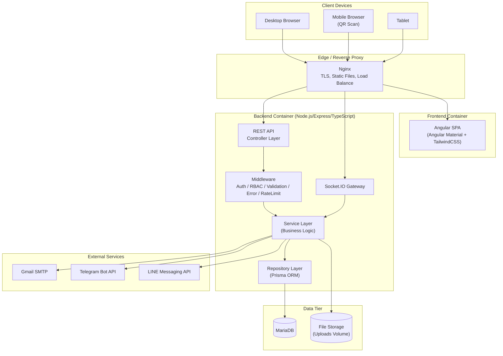
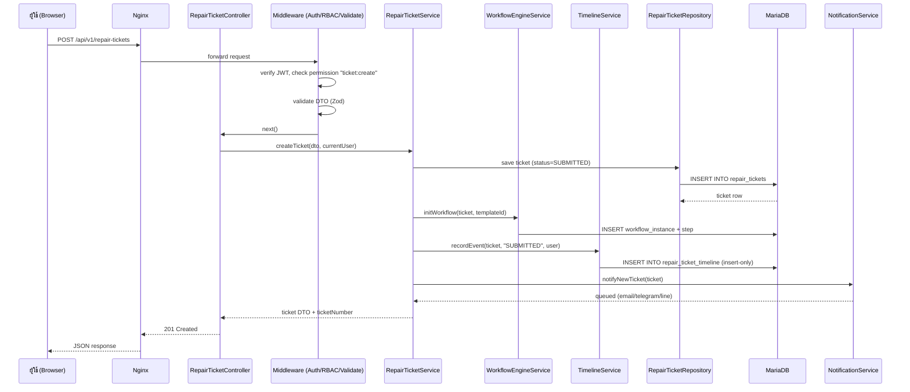
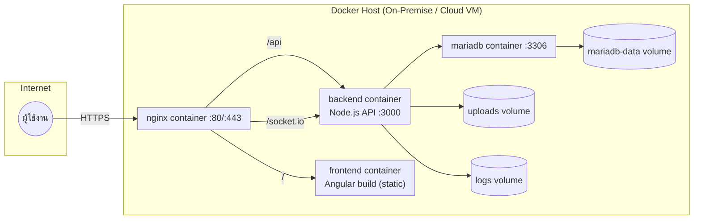

# 1. Software Architecture

## ระบบแจ้งซ่อมอุปกรณ์และระบบคอมพิวเตอร์ สำนักงานสาธารณสุขจังหวัดนครราชสีมา
### IT Service Desk & Asset Maintenance Management System (KHD-IT-SUP)

---

## 1.1 ภาพรวมสถาปัตยกรรม (Architecture Overview)

ระบบถูกออกแบบเป็น **Modular Monolith** ฝั่ง Backend (Node.js/Express/TypeScript) ที่ยึดหลัก **Clean Architecture**
ร่วมกับ **Repository Pattern** และ **Service Layer** เพื่อแยก business logic ออกจาก framework/infrastructure
ทำให้ทดสอบง่าย ขยายเป็น microservice ได้ในอนาคตหากจำเป็น โดยไม่ต้องเขียนใหม่ทั้งหมด

Frontend เป็น **Angular SPA** แยก deploy อิสระจาก Backend สื่อสารผ่าน REST API (+ WebSocket สำหรับ realtime)
โดยมี Nginx เป็น Reverse Proxy ทำหน้าที่ TLS termination, static file serving และ routing ไปยัง service ที่ถูกต้อง



---

## 1.2 หลักการออกแบบ (Design Principles)

| หลักการ | การนำไปใช้ในระบบนี้ |
|---|---|
| **Clean Architecture** | แบ่งเป็น Controller → Service → Repository → Prisma/DB โดย dependency ชี้เข้าหา core เสมอ |
| **Repository Pattern** | ทุก module มี Repository รับผิดชอบเฉพาะการเข้าถึงข้อมูล (Prisma Client) ไม่มี business logic |
| **Service Layer** | รวม business logic, workflow rules, transaction ทั้งหมดไว้ที่ Service เท่านั้น |
| **DTO + Validation** | ทุก endpoint มี Request DTO (Zod schema) validate ก่อนเข้าสู่ Service เสมอ |
| **SOLID** | Single Responsibility ต่อไฟล์/คลาส, Dependency Injection ผ่าน constructor, Interface สำหรับ Repository |
| **Modular Design** | แยกตาม Domain Module (auth, users, assets, repair-tickets, workflow, ...) ไม่ใช่แยกตาม technical layer อย่างเดียว |
| **Immutable Timeline** | Timeline event เป็น insert-only, ห้าม update/delete ที่ระดับ DB (ไม่มี UPDATE/DELETE grant บน timeline table ใน production) |
| **Fail-Safe Defaults** | RBAC เป็น deny-by-default, ทุก route ต้องประกาศ permission ที่ต้องการอย่างชัดเจน |

---

## 1.3 Backend Layered Architecture

```
┌─────────────────────────────────────────────────────────────┐
│  Presentation Layer   →  Controllers, Routes, Swagger Docs   │
├─────────────────────────────────────────────────────────────┤
│  Middleware Layer     →  Auth(JWT), RBAC Guard, Validation,  │
│                          RateLimit, Helmet, Error Handler    │
├─────────────────────────────────────────────────────────────┤
│  Application Layer    →  Services (Business Logic, Workflow  │
│                          Engine, Transaction Orchestration)  │
├─────────────────────────────────────────────────────────────┤
│  Domain Layer         →  Entities, DTO, Enums, Domain Errors │
├─────────────────────────────────────────────────────────────┤
│  Infrastructure Layer →  Repository (Prisma), Mailer,        │
│                          Telegram/LINE Client, Socket.IO,    │
│                          QR Generator, File Storage, Logger  │
└─────────────────────────────────────────────────────────────┘
```

**กฎการพึ่งพา (Dependency Rule):** ชั้นบนเรียกใช้ชั้นล่างได้เท่านั้น ห้ามชั้นล่างรู้จักชั้นบน
Controller ไม่เรียก Repository ตรง ๆ ต้องผ่าน Service เท่านั้น — ทำให้ Service ทดสอบได้แบบ unit test โดย mock Repository interface

### ตัวอย่าง flow คำขอ 1 ครั้ง (Create Repair Ticket)



---

## 1.4 Frontend Architecture (Angular)

```
AppComponent (Shell)
 ├── CoreModule (Singleton: AuthService, TokenInterceptor, ErrorInterceptor, RbacGuard)
 ├── SharedModule (Reusable: Buttons, Tables, Dialogs, StatusBadge, Timeline UI)
 ├── LayoutModule (Sidebar, Topbar, Breadcrumb, ThemeToggle)
 └── Feature Modules (Lazy-loaded, 1 route per business module)
      ├── AuthModule
      ├── DashboardModule
      ├── AssetsModule
      ├── RepairTicketsModule
      ├── QrModule (public scan page, no auth)
      ├── UsersModule
      └── SettingsModule
```

- ใช้ **Standalone Components + Lazy Loading** ของ Angular เพื่อลด initial bundle size
- **State Management**: RxJS + Angular Signals (service-based state, ไม่ใช้ NgRx เพื่อลดความซับซ้อนเกินจำเป็นสำหรับขนาดระบบนี้)
- **HTTP Interceptor** แนบ JWT Access Token ทุก request, ดัก 401 เพื่อ refresh token อัตโนมัติ
- **RBAC Guard** ระดับ route + structural directive (`*hasPermission="'asset:delete'"`) ระดับ UI element

---

## 1.5 Security Architecture

| ชั้นการป้องกัน | เทคนิค |
|---|---|
| Transport | HTTPS Ready (Nginx TLS termination), HSTS header |
| HTTP Headers | Helmet.js (CSP, X-Frame-Options, X-Content-Type-Options) |
| Rate Limiting | express-rate-limit ต่อ IP + ต่อ endpoint (login เข้มกว่า endpoint ทั่วไป) |
| Authentication | JWT Access Token (อายุสั้น 15 นาที) + Refresh Token (httpOnly cookie, 7 วัน, rotation) |
| Authorization | RBAC middleware ตรวจ permission ต่อ route จาก Permission Matrix |
| Input Validation | Zod schema ทุก DTO, sanitize ก่อนเข้า business logic |
| SQL Injection | Prisma ORM (parameterized query เสมอ, ไม่มี raw string concat) |
| XSS | Helmet CSP + Angular auto-escaping + sanitize rich text input |
| Password | bcrypt (cost factor 12), password policy บังคับความซับซ้อน |
| Secrets | Environment Variables (.env, ไม่ commit), แยก secret ต่อ environment |
| Audit | Audit Log บันทึกทุก action สำคัญ (login, CRUD, delete, print, approve) |
| File Upload | Multer + validate MIME type/size, สแกนนามสกุลไฟล์อันตราย, จัดเก็บนอก web root |

---

## 1.6 Workflow Engine Architecture

Workflow Engine เป็น module อิสระ (`modules/workflow`) ไม่ผูกกับ Repair Ticket โดยตรง เพื่อให้นำไปใช้กับ
กระบวนการอื่นในอนาคตได้ (เช่น Purchase Approval) ออกแบบเป็น **State Machine ที่กำหนดค่าได้ (Configurable State Machine)**

- `workflow_templates` นิยามผัง step ทั้งหมด (Internal Repair / External Repair / ...)
- `workflow_steps` นิยามแต่ละ step: role ที่รับผิดชอบ, SLA (ชั่วโมง), ต้อง approve หรือไม่, เอกสารที่ต้องแนบ
- `workflow_transitions` นิยาม step ถัดไปที่เป็นไปได้จาก step ปัจจุบัน (รองรับ branch เช่น Internal/External)
- `workflow_instances` คือ instance ที่ผูกกับ ticket จริง 1 รายการ, เก็บ step ปัจจุบัน
- ทุกการเปลี่ยน step จะเรียก `TimelineService.recordEvent()` เสมอ (insert-only, ห้ามลบ/แก้ไข)
- SLA คำนวณจาก `workflow_steps.sla_hours` เทียบกับเวลาปัจจุบัน แสดงผลเป็น Progress % และ Remaining SLA

รายละเอียด state diagram ของ Internal/External Repair Workflow อยู่ใน [docs/diagrams/flowchart-workflow.md](diagrams/flowchart-workflow.md)

Phase แรกของระบบ (MVP) จะ implement **Internal Repair Workflow แบบ fixed แต่ configurable ผ่านตาราง** ก่อน
ส่วน **Flow Designer แบบลากวาง (Visual Editor)** และ External Repair 14-step approval chain แบบเต็ม จะเพิ่มใน Phase ถัดไป
(ดู [docs/00-roadmap.md](00-roadmap.md))

---

## 1.7 Technology Stack Summary

| Layer | Technology |
|---|---|
| Backend Runtime | Node.js 20 LTS |
| Backend Framework | Express.js 4 + TypeScript 5 |
| ORM | Prisma ORM (MariaDB provider) |
| Database | MariaDB 11 LTS |
| Auth | JWT (jsonwebtoken) + bcrypt |
| Validation | Zod |
| Realtime | Socket.IO |
| File Upload | Multer |
| QR Code | `qrcode` npm package + AES encrypted payload |
| Email | Nodemailer (Gmail SMTP) |
| Chat Notification | Telegram Bot API, LINE Messaging API |
| API Docs | Swagger (swagger-jsdoc + swagger-ui-express) — OpenAPI 3.0 |
| Testing | Jest + Supertest |
| Frontend Framework | Angular 18 (Standalone Components) |
| UI Library | Angular Material + TailwindCSS |
| Icons | HeroIcons |
| Reactive | RxJS + Angular Signals |
| Container | Docker + Docker Compose |
| Reverse Proxy | Nginx |
| Logger | Winston (JSON structured logs, daily rotate) |

---

## 1.8 Deployment Diagram



ดูรายละเอียดเพิ่มเติม: [Folder Structure](02-folder-structure.md) · [Database Design](03-database-design.md) · [ER Diagram](04-er-diagram.md) · [API Design](05-api-design.md)
