# Class Diagram — Service Layer

แสดง class หลักในชั้น Service (business logic) ของ backend และความสัมพันธ์ระหว่างกัน — ตรงกับโค้ดจริงใน
`backend/src/modules/*/services/*.ts` (ดู entity/data model แบบเต็มที่ [04-er-diagram.md](../04-er-diagram.md))

```mermaid
classDiagram
    class AuthService {
        -AuthRepository repo
        +login(username, password, ctx) ILoginResult
        +refresh(token, ctx) ILoginResult
        +logout(token) void
        +changePassword(userId, current, next) void
    }

    class UserService {
        -UserRepository repo
        +list(query) IPaginatedResult
        +create(dto, ctx) User
        +update(id, dto, ctx) User
        +resetPassword(id, ctx) string
        +listRoles() Role[]
        +listTechnicians() User[]
    }

    class AssetService {
        -AssetRepository repo
        +list(query) IPaginatedResult
        +create(dto, ctx) Asset
        +update(id, dto, ctx) Asset
        +getHistory(id) RepairTicket[]
        +addPhotos(id, files, ctx) AssetPhoto[]
    }

    class QrCodeService {
        -QrCodeRepository repo
        +generate(assetId, ctx) IGenerateQrResult
        +resolve(token, userId, ip, ua) Asset
        +bulkPrint(assetIds) IPrintResult[]
    }

    class WorkflowService {
        -WorkflowRepository repo
        +initWorkflow(templateCode, entityId, tx) IWorkflowInitResult
        +transition(instanceId, toStepCode, conditionKey, tx) IWorkflowTransitionResult
        +getTemplateStructure(code) WorkflowTemplate
    }

    class TimelineService {
        -TimelineRepository repo
        +recordEvent(input, tx) TimelineEvent
        +findByTicketId(ticketId) TimelineEvent[]
        note "insert-only — ไม่มี update()/delete()"
    }

    class RepairTicketService {
        -RepairTicketRepository repo
        +create(dto, ctx) RepairTicket
        +receive(id, ctx) RepairTicket
        +assign(id, dto, ctx) RepairTicket
        +transition(id, dto, ctx) RepairTicket
        +cancel(id, reason, ctx) RepairTicket
        +close(id, ctx) RepairTicket
        +getProgress(ticket) IProgress
        -applyTransition(...) RepairTicket
        -notifySafe(event, ticket, label) void
    }

    class NotificationService {
        -NotificationRepository repo
        +notifyTicketEvent(event, ticket, label) void
        -resolveRecipients(event, ticket) Recipient[]
        -sendEmail(to, subject, html) void
    }

    class DashboardService {
        -DashboardRepository repo
        +getSummary() IDashboardSummary
        +getMonthlyChart(year) IMonthlyChartPoint[]
        +getDepartmentRanking(limit) IDepartmentRankingItem[]
        +getAnalytics() IDashboardAnalytics
    }

    class RunningNumberService {
        +getNextNumber(docType) string
        note "atomic ผ่าน prisma.$transaction"
    }

    class AuditLogService {
        +record(input, ctx) void
        note "insert-only เช่นเดียวกับ TimelineService"
    }

    RepairTicketService --> WorkflowService : ใช้ transition()
    RepairTicketService --> TimelineService : บันทึกทุก event
    RepairTicketService --> NotificationService : แจ้งเตือนหลัง commit
    RepairTicketService --> RunningNumberService : ออกเลขที่ ticket
    RepairTicketService --> AuditLogService : บันทึกการกระทำ
    AssetService --> RunningNumberService : ออกเลขที่ครุภัณฑ์
    AssetService --> AuditLogService
    QrCodeService --> AssetService : ตรวจสอบครุภัณฑ์มีอยู่จริง
    UserService --> AuditLogService
    AuthService --> AuditLogService
```

