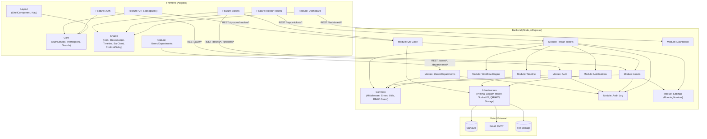

# Component Diagram

แสดงความสัมพันธ์ระดับ module/component ของทั้งระบบ (ต่างจาก [deployment diagram](../01-architecture.md#18-deployment-diagram)
ที่แสดงระดับ container/infrastructure)

```mermaid
flowchart TB
    subgraph FE["Frontend (Angular)"]
        direction TB
        FE_Core["Core<br/>(AuthService, Interceptors, Guards)"]
        FE_Shared["Shared<br/>(Icon, StatusBadge, Timeline, BarChart, ConfirmDialog)"]
        FE_Layout["Layout<br/>(ShellComponent, Nav)"]
        FE_Auth["Feature: Auth"]
        FE_Dashboard["Feature: Dashboard"]
        FE_Assets["Feature: Assets"]
        FE_Tickets["Feature: Repair Tickets"]
        FE_Users["Feature: Users/Departments"]
        FE_QR["Feature: QR Scan (public)"]

        FE_Layout --> FE_Core
        FE_Dashboard --> FE_Shared
        FE_Tickets --> FE_Shared
        FE_Assets --> FE_Shared
        FE_Auth --> FE_Core
        FE_QR --> FE_Core
    end

    subgraph BE["Backend (Node.js/Express)"]
        direction TB
        BE_Common["Common<br/>(Middleware, Errors, Utils, RBAC Guard)"]
        BE_Infra["Infrastructure<br/>(Prisma, Logger, Mailer, Socket.IO, QR/AES, Storage)"]
        BE_Auth["Module: Auth"]
        BE_Users["Module: Users/Departments"]
        BE_Assets["Module: Assets"]
        BE_QR["Module: QR Code"]
        BE_Workflow["Module: Workflow Engine"]
        BE_Timeline["Module: Timeline"]
        BE_Tickets["Module: Repair Tickets"]
        BE_Notify["Module: Notifications"]
        BE_Dashboard["Module: Dashboard"]
        BE_Audit["Module: Audit Log"]
        BE_Settings["Module: Settings (RunningNumber)"]

        BE_Tickets --> BE_Workflow
        BE_Tickets --> BE_Timeline
        BE_Tickets --> BE_Notify
        BE_Tickets --> BE_Settings
        BE_Tickets --> BE_Audit
        BE_Assets --> BE_Settings
        BE_Assets --> BE_Audit
        BE_QR --> BE_Assets
        BE_Auth --> BE_Audit
        BE_Users --> BE_Audit

        BE_Auth --> BE_Common
        BE_Users --> BE_Common
        BE_Assets --> BE_Common
        BE_Tickets --> BE_Common
        BE_Notify --> BE_Infra
        BE_Timeline --> BE_Infra
        BE_QR --> BE_Infra
    end

    subgraph DB["Data / External"]
        MariaDB[("MariaDB")]
        SMTP["Gmail SMTP"]
        FS[("File Storage")]
    end

    FE_Auth -- "REST /auth/*" --> BE_Auth
    FE_Dashboard -- "REST /dashboard/*" --> BE_Dashboard
    FE_Assets -- "REST /assets/*, /qrcodes/*" --> BE_Assets
    FE_Assets --> BE_QR
    FE_Tickets -- "REST /repair-tickets/*" --> BE_Tickets
    FE_Users -- "REST /users/*, /departments/*" --> BE_Users
    FE_QR -- "REST /qrcodes/resolve/*" --> BE_QR

    BE_Infra --> MariaDB
    BE_Infra --> SMTP
    BE_Infra --> FS
```
