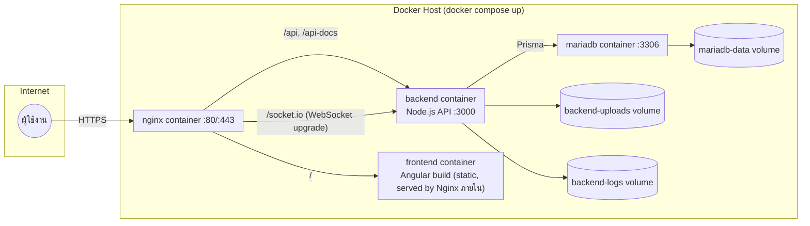

# Deployment Diagram

ตรงกับ `docker-compose.yml` จริง — ดูคำอธิบายประกอบเต็มที่ [01-architecture.md § 1.8](../01-architecture.md#18-deployment-diagram)

## Container Images

| Container | Base Image | Build |
|---|---|---|
| `khd_it_sup_nginx` | `nginx:alpine` | ใช้ image สำเร็จรูป, mount `docker/nginx/nginx.conf` |
| `khd_it_sup_frontend` | `node:20-alpine` (build) → `nginx:1.27-alpine` (runtime) | `frontend/Dockerfile` (multi-stage) |
| `khd_it_sup_backend` | `node:20-alpine` (multi-stage: deps/build/prod-deps/runtime) | `backend/Dockerfile` |
| `khd_it_sup_db` | `mariadb:11` | official image, auto-init จาก `database/schema.sql` + `seed.sql` |

ทดสอบแล้วว่า `docker compose up -d --build` รันสำเร็จครบทั้ง 4 container จาก database ว่างเปล่า (ดู [00-roadmap.md](../00-roadmap.md))
