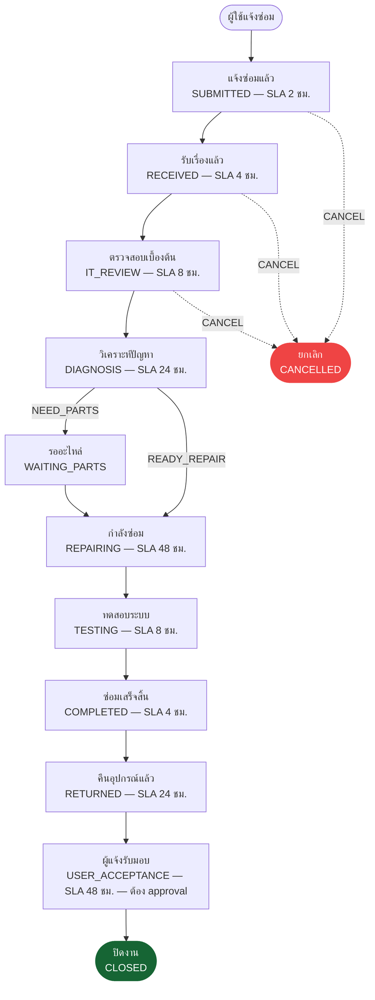
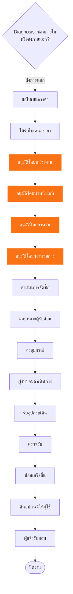

# Flowchart — Repair Workflow

## Internal Repair (✅ Implemented — `workflow_templates.code = 'REPAIR_INTERNAL'`)

ตรงกับข้อมูลจริงใน `database/seed.sql` (workflow_steps + workflow_transitions) — ทดสอบ lifecycle เต็มแล้ว (ดู [00-roadmap.md](../00-roadmap.md))

**กฎสำคัญ**: การเปลี่ยนสถานะทุกครั้งต้องผ่าน `WorkflowService.transition()` ซึ่งตรวจสอบว่ามีเส้นทาง (edge) ที่ config
ไว้ใน `workflow_transitions` จริงเท่านั้น — เรียกข้ามขั้นตอน (เช่น SUBMITTED → CLOSED ตรง ๆ) จะถูกปฏิเสธด้วย `409 CONFLICT`
เสมอ (ดู [11-api-manual.md § 11.6](../11-api-manual.md#116-workflow-engine--ข้อควรรู้สำหรับผู้เรียก-api))

---

## External Repair (🔜 Phase 10+ — ออกแบบไว้แล้ว ยังไม่ implement)

Flow ที่วางแผนไว้ตามสเปกข้อ 37/38 — ตารางฐานข้อมูลรองรับแล้ว (`vendor_repair_orders`, `approvals`) แต่ยังไม่มี
`workflow_templates` row สำหรับ `REPAIR_EXTERNAL` และยังไม่มี Service/Controller/UI รองรับ

## Document Workflow ที่เกี่ยวข้อง (🔜 Phase 10+)

เอกสารราชการ 14 ประเภทตามสเปกข้อ 38 (ใบแจ้งซ่อม → ใบรับแจ้งซ่อม → ... → ปิดงาน) จะถูกสร้างอัตโนมัติที่แต่ละจุดของ
External Repair Flow ด้านบน โดยใช้ตาราง `document_templates`/`generated_documents` ที่มีอยู่แล้วในฐานข้อมูล
