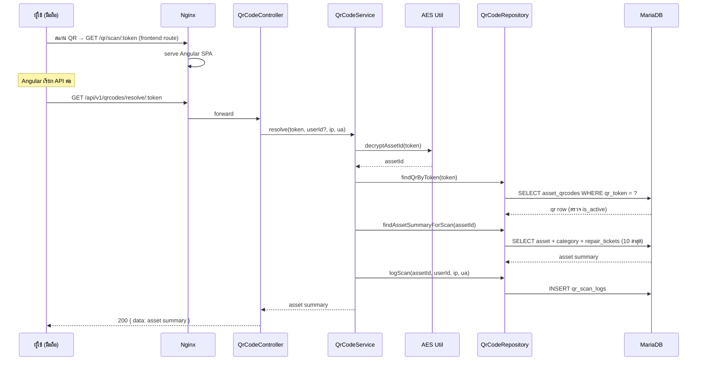
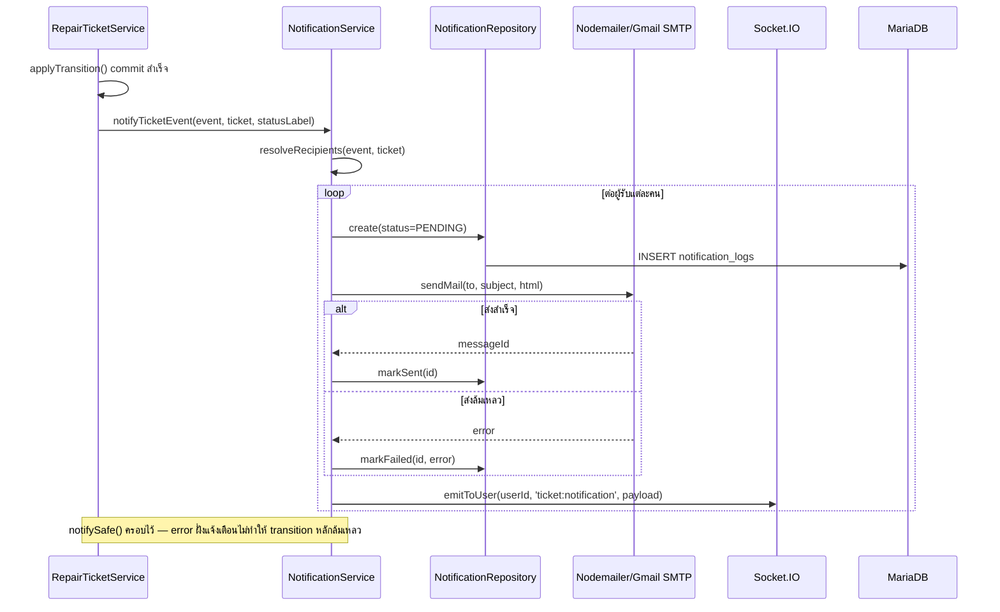

# Sequence Diagrams

Diagram หลัก (สร้างใบแจ้งซ่อม) อยู่ที่ [01-architecture.md § 1.3](../01-architecture.md#ตัวอย่าง-flow-คำขอ-1-ครั้ง-create-repair-ticket)
— ไฟล์นี้เพิ่มเติม flow สำคัญอีก 2 แบบ

## QR Scan → ดูข้อมูลครุภัณฑ์ (Public, ไม่ต้อง login)

## Notification Dispatch (หลัง Ticket Transition สำเร็จ)

