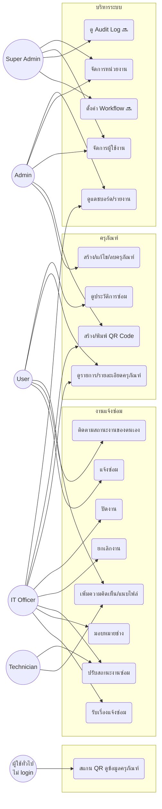

# Use Case Diagram

ครอบคลุมเฉพาะ use case ที่ implement แล้ว (Phase 1-8) — เครื่องหมาย 🔜 คือ Phase 10+

## คำอธิบาย Actor

| Actor | สิทธิ์โดยสรุป |
|---|---|
| Guest | สแกน QR ดูข้อมูลครุภัณฑ์ได้โดยไม่ต้อง login |
| User | แจ้งซ่อม, ติดตามงานของตนเอง, ดูครุภัณฑ์/ประวัติ |
| Technician | ปรับสถานะงานซ่อม, แนบไฟล์/รูปก่อน-หลังซ่อม |
| IT Officer | รับเรื่อง, มอบหมายช่าง, ปรับสถานะ, ดูแดชบอร์ด |
| Admin | ทุกอย่างของ IT Officer + จัดการครุภัณฑ์/ผู้ใช้/หน่วยงานเต็มรูปแบบ |
| Super Admin | ทุกอย่าง รวมถึงการตั้งค่าระบบและฟีเจอร์ Phase 10+ |
